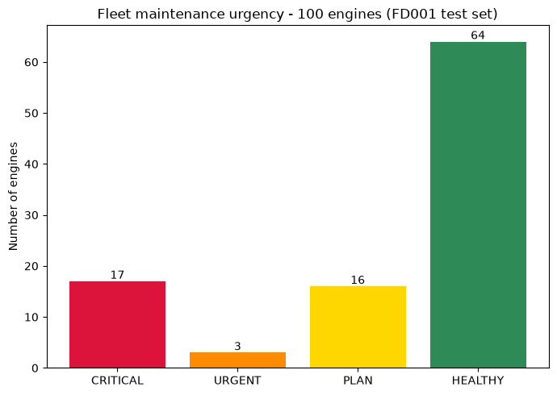
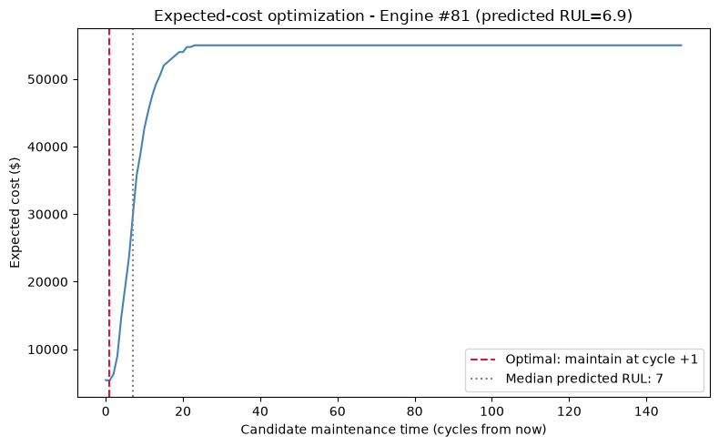

# 🛠️ AI-Powered Predictive Maintenance System — Turbofan Engines

Predicting Remaining Useful Life (RUL), failure probability, and root cause for jet engines — then turning those predictions into an actual maintenance decision, with a cost-based scheduling model. Built on NASA's industry-standard C-MAPSS benchmark.

> **Status:** Phases 1–2 complete (RUL prediction, explainability, failure probability, maintenance scheduling). LSTM, anomaly detection, vibration analysis, and an interactive dashboard are in progress — see [Roadmap](#roadmap).

## The Problem

Unplanned machine failure is one of the costliest events in manufacturing and aviation. This project predicts how many operating cycles a turbofan engine has left before failure, explains *why*, scores the probability of failure within a maintenance-relevant window, and recommends *when* to actually schedule maintenance — balancing the cost of failing too late against the cost of servicing too early.

## Results

### RUL Prediction (Phase 1)
| Model | RMSE (cycles) | MAE (cycles) |
|---|---|---|
| Random Forest | 17.9 | 12.4 |
| **XGBoost** | **17.4** | **12.4** |

Evaluated on the official held-out test set (100 unseen engines) using the asymmetric **PHM08 scoring function** — the metric from the original NASA prognostics competition — because in real maintenance, predicting *too late* is far more costly than predicting early.

### Failure Probability (Phase 2)
| Horizon | ROC-AUC | Avg. Precision |
|---|---|---|
| Fail within 15 cycles | 0.998 | 0.983 |
| Fail within 30 cycles | 0.969 | 0.915 |
| Fail within 45 cycles | 0.981 | 0.960 |

Calibration curves confirm predicted probabilities track real observed failure rates closely — not just high-accuracy, but trustworthy enough to base cost decisions on.

### Fleet Maintenance Report (Phase 2)
Of 100 test engines: **17 CRITICAL, 2 URGENT, 17 PLAN, 64 HEALTHY** — each with a specific recommended maintenance window (in cycles from now) computed via expected-cost optimization, not a fixed threshold.



### Explainable Root Cause (Phase 1)
The model independently identifies **HPC (High Pressure Compressor) degradation** — sensors `s_4` (LPT outlet temp) and `s_11` (HPC outlet pressure) dominate every failure case — matching NASA's documented fault mode for this dataset exactly, without being told what it was.


### Cost-Optimal Maintenance Timing (Phase 2)
For each engine, expected cost is computed across candidate maintenance times by trading off unplanned-failure risk against wasted remaining life, using the Random Forest's own tree ensemble as an empirical RUL distribution:



## Tech Stack

`Python` · `Pandas` · `Scikit-learn` · `XGBoost` · `SHAP` · `Matplotlib/Seaborn` · `Streamlit` (Phase 6)

## Dataset

NASA C-MAPSS Turbofan Engine Degradation Simulation — the standard academic/industry benchmark for RUL prediction. 100 engines run to failure under realistic sensor noise (21 sensors: temperatures, pressures, rotational speeds).

## Quick Start

```bash
git clone https://github.com/<your-username>/predictive-maintenance-turbofan.git
cd predictive-maintenance-turbofan
python -m venv venv
venv\Scripts\activate          # Windows
pip install -r requirements.txt

python src/data_loader.py            # load + label data
python src/eda.py                    # diagnostic plots
python src/train_baseline.py         # RF + XGBoost RUL models
python src/explainability.py         # SHAP root-cause analysis
python src/failure_probability.py    # multi-horizon failure classifiers
python src/maintenance_scheduler.py  # cost-optimal scheduling + fleet report
```

## Project Structure
├── data/raw/                  # NASA C-MAPSS dataset (FD001-FD004)

├── src/

│   ├── data_loader.py         # Data loading + RUL labeling

│   ├── features.py            # Rolling-window feature engineering

│   ├── eda.py                  # Exploratory analysis

│   ├── train_baseline.py      # RF + XGBoost RUL models

│   ├── explainability.py      # SHAP root-cause analysis

│   ├── failure_probability.py # Multi-horizon failure classifiers + calibration

│   └── maintenance_scheduler.py # Cost-optimal scheduling, urgency tiers, fleet report

├── models/                     # Trained model artifacts

└── outputs/

├── plots/                  # All generated visualizations

└── fleet_maintenance_report.csv  # Per-engine maintenance recommendations

## Key Engineering Decisions

- **Piecewise RUL capping at 125 cycles** — early-life sensor data carries no learnable signal about exact remaining life, so the label is flattened during the healthy plateau.
- **Engine-level train/validation split** — splitting by row leaks information across an engine's trajectory; splitting by engine ID tests genuine generalization to unseen machines.
- **Rolling-window features** (mean/std/slope) over raw sensor readings, to capture trend rather than noise.
- **Separate classifier for failure probability**, rather than thresholding the RUL regressor — a regressor optimized for RMSE across the full range isn't necessarily well-calibrated at the specific boundary (e.g. "30 cycles") that matters operationally.
- **Expected-cost optimization for scheduling**, instead of a fixed RUL threshold — explicitly trades off the cost of an unplanned failure against the cost of wasting remaining useful life, using the Random Forest's own tree ensemble as a free, honest uncertainty distribution.

## Roadmap

- [x] **Phase 1:** RUL prediction (RF + XGBoost) + SHAP explainability
- [x] **Phase 2:** Failure probability scoring + cost-based maintenance scheduler
- [ ] **Phase 3:** Isolation Forest anomaly detection
- [ ] **Phase 4:** LSTM sequence model
- [ ] **Phase 5:** Vibration/temperature analysis module (rotating machinery)
- [ ] **Phase 6:** Interactive Streamlit dashboard

## License

MIT — see [LICENSE](LICENSE). Dataset courtesy of NASA's Prognostics Data Repository.


