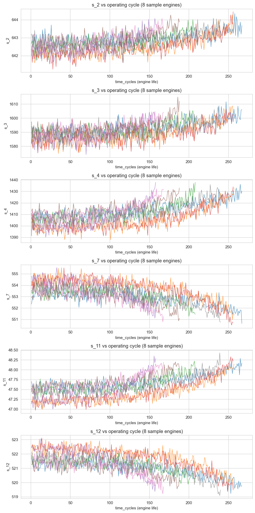
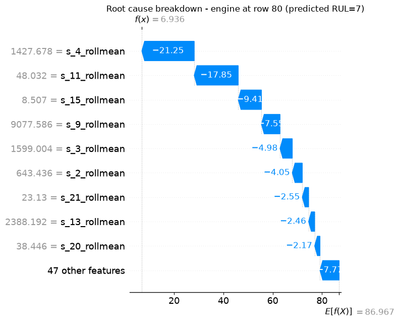

# 🛠️ AI-Powered Predictive Maintenance System — Turbofan Engines

Predicting Remaining Useful Life (RUL) of jet engines from sensor data, with explainable root-cause analysis — built on NASA's industry-standard C-MAPSS benchmark dataset.

> **Status:** Phase 1 complete (RUL prediction + explainability). Anomaly detection, LSTM, failure-probability scoring, maintenance scheduling, and an interactive dashboard are in active development — see [Roadmap](#roadmap).

## The Problem

Unplanned machine failure is one of the costliest events in manufacturing and aviation. This project predicts **how many operating cycles a turbofan engine has left** before failure, using only streaming sensor data — and explains *why*, so the output is actionable for a maintenance engineer, not just a number.

## Results

| Model | RMSE (cycles) | MAE (cycles) |
|---|---|---|
| Random Forest | 17.9 | 12.4 |
| **XGBoost** | **17.4** | **12.4** |

Evaluated on the official held-out test set (100 unseen engines), using the asymmetric **PHM08 scoring function** (the metric from the original NASA prognostics competition), not just RMSE — because in real maintenance, a *late* prediction (engine fails sooner than predicted) is far more costly than an early one.

### Sensor degradation trends


### Explainable root-cause analysis (SHAP)
The model independently identifies **HPC (High Pressure Compressor) degradation** — sensor `s_4` (LPT outlet temp) and `s_11` (HPC outlet pressure) dominate every failure case — which matches NASA's documented fault mode for this dataset exactly, without being told what it was.



## Tech Stack

`Python` · `Pandas` · `Scikit-learn` · `XGBoost` · `SHAP` · `Matplotlib/Seaborn` · `Streamlit` (Phase 6)

## Dataset

NASA C-MAPSS Turbofan Engine Degradation Simulation — the standard academic/industry benchmark for RUL prediction. 100 engines run to failure under realistic sensor noise (21 sensors: temperatures, pressures, rotational speeds).

## Quick Start

```bash
git clone https://github.com/<your-username>/predictive-maintenance-turbofan.git
cd predictive-maintenance-turbofan
python -m venv venv
venv\Scripts\activate          # Windows
pip install -r requirements.txt

python src/data_loader.py      # load + label data
python src/eda.py              # generate diagnostic plots
python src/train_baseline.py   # train RF + XGBoost, print metrics
python src/explainability.py   # SHAP root-cause analysis
```

## Project Structure
├── data/raw/              # NASA C-MAPSS dataset (FD001-FD004)

├── src/

│   ├── data_loader.py     # Data loading + RUL labeling

│   ├── features.py        # Rolling-window feature engineering

│   ├── eda.py              # Exploratory analysis

│   ├── train_baseline.py  # RF + XGBoost RUL models

│   └── explainability.py  # SHAP root-cause analysis

├── models/                # Trained model artifacts

└── outputs/plots/         # Generated visualizations

## Key Engineering Decisions

- **Piecewise RUL capping at 125 cycles** — early-life sensor data carries no learnable signal about exact remaining life, so the label is flattened during the healthy plateau (standard practice in C-MAPSS literature).
- **Engine-level train/validation split** — splitting by row leaks information across an engine's trajectory; splitting by engine ID tests genuine generalization to unseen machines.
- **Rolling-window features** (mean/std/slope) over raw sensor readings, to capture trend rather than noise.

## Roadmap

- [x] **Phase 1:** RUL prediction (RF + XGBoost) + SHAP explainability
- [ ] **Phase 2:** Failure probability scoring + rule-based maintenance scheduler
- [ ] **Phase 3:** Isolation Forest anomaly detection
- [ ] **Phase 4:** LSTM sequence model
- [ ] **Phase 5:** Vibration/temperature analysis module (rotating machinery)
- [ ] **Phase 6:** Interactive Streamlit dashboard

## License

MIT — see [LICENSE](LICENSE). Dataset courtesy of NASA's Prognostics Data Repository.


